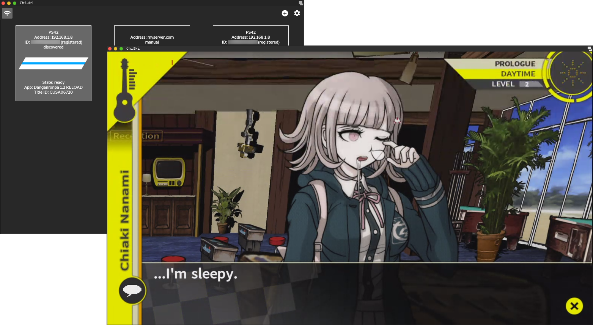

# Chiaki

**Disclaimer:** This project is not endorsed or certified by Sony Interactive Entertainment LLC.

[](https://travis-ci.com/thestr4ng3r/chiaki) [](https://ci.appveyor.com/project/thestr4ng3r/chiaki)

Chiaki is a Free and Open Source Software Client for PlayStation 4 Remote Play
for Linux, macOS, Windows and potentially even more platforms.



## Features

Everything necessary for a full streaming session, including the initial
registration and wakeup of the console, is supported.
The following features however are yet to be implemented:
* Congestion Control
* H264 Error Concealment (FEC and active error recovery however are implemented)
* Make the console send in higher Bitrate (if possible)
* Touchpad support (Triggering the Touchpad Button is currently possible by pressing `T` on the keyboard)
* Configurable Keybindings

## Downloading a Release

Builds are provided for Linux, macOS and Windows. You can find them [here](https://github.com/thestr4ng3r/chiaki/releases).

* **Linux**: The provided file is an [AppImage](https://appimage.org/). Simply make it executable (`chmod +x <file>.AppImage`) and run it.
* **macOS**: Drag the application from the `.dmg` into your Applications folder.
* **Windows**: Extract the `.zip` file and execute `chiaki.exe`.

## Building from Source

Dependencies are CMake, Qt 5 with QtMultimedia, QtOpenGL and QtSvg, FFMPEG (libavcodec with H264 is enough), libopus, OpenSSL 1.1,
protoc and the protobuf Python library (only used during compilation for Nanopb).
Then, Chiaki builds just like any other CMake project:
```
mkdir build && cd build
cmake ..
make
```

## Acknowledgements

This project has only been made possible because of the following Open Source projects:
[radare2](https://github.com/radare/radare2),
[Cutter](https://cutter.re/),
[Frida](https://www.frida.re/) and
[x64dbg](https://x64dbg.com/).

Also thanks to [delroth](https://github.com/delroth) for analyzing the registration and wakeup protocol,
as well as a huge thank you to [FioraAeterna](https://github.com/FioraAeterna) for giving me some
extremely helpful information about FEC and error correction.

## About

Created by Florian Märkl.

This program is free software: you can redistribute it and/or modify
it under the terms of the GNU General Public License as published by
the Free Software Foundation, either version 3 of the License, or
(at your option) any later version.

This program is distributed in the hope that it will be useful,
but WITHOUT ANY WARRANTY; without even the implied warranty of
MERCHANTABILITY or FITNESS FOR A PARTICULAR PURPOSE.  See the
GNU General Public License for more details.

You should have received a copy of the GNU General Public License
along with this program.  If not, see <https://www.gnu.org/licenses/>.